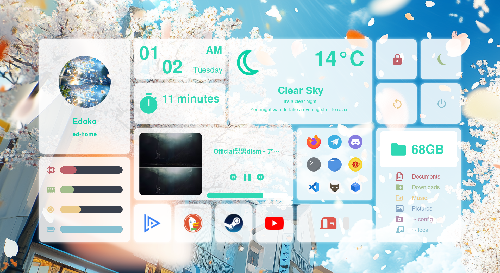
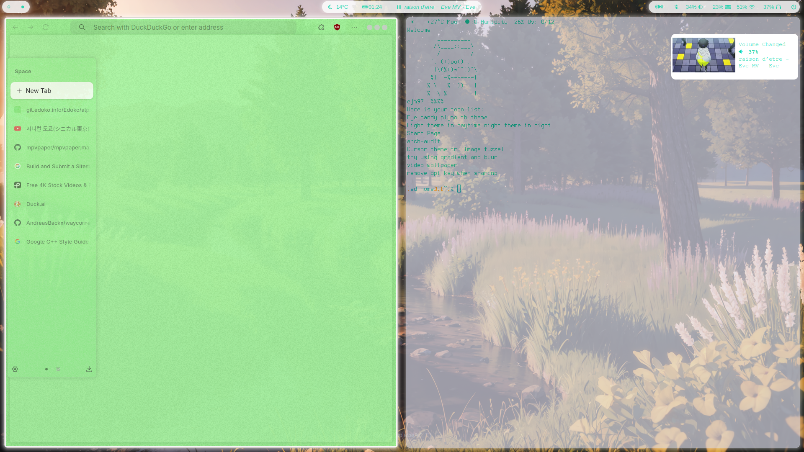
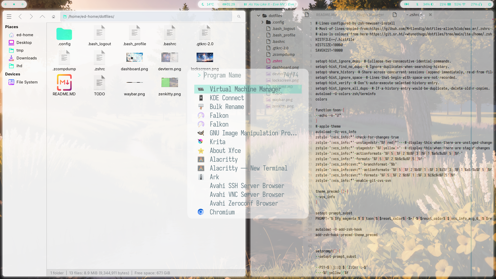
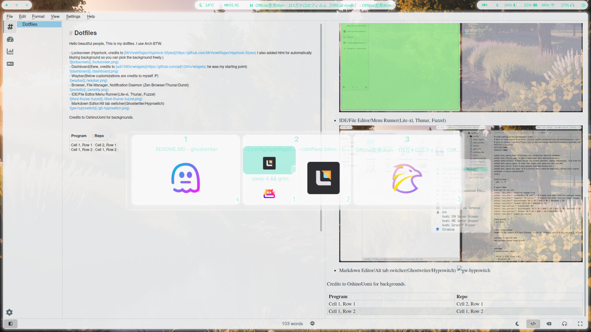

# Dotfiles

Hello beautiful people, This is my dotfiles. I use Arch BTW. Specially thanks to vaxry for Hyprland and Hypr family.

- Lockscreen (Hyprlock, credits to [MrVivekRajan/Hyprlock-Styles](https://github.com/MrVivekRajan/Hyprlock-Styles) I also added html for automatically bluring background so you can pick the background freely.)

- Dashboard(Eww, credits to [adi1090x/widgets](https://github.com/adi1090x/widgets) he was my starting point)

-Login Manager(SDDM, Fully credits to [3ximus/aerial-sddm-theme](https://github.com/3ximus/aerial-sddm-theme) I didn't made any changes for SDDM, Beautiful theme thanks for devs to sharing)

- Waybar(Below customizations are credits to myself :P)

- Browser, Terminal, Notification Daemon (Zen Browser/Kitty/Dunst)

- IDE/File Editor/Menu Runner(Lite-xl(credit to all plugin owners), Thunar(sweet gtk theme/icons), Fuzzel)

- Markdown Editor/Alt tab switcher(Ghostwriter/Hyprswitch)

- Credits to [OshinoUomi](https://www.pixiv.net/en/users/11065404) and [hary](https://www.pixiv.net/en/users/13009126) for backgrounds(wallpapers).
- Also profile photo in hyprlock is from [here](https://www.pixiv.net/en/artworks/129953121)

Also Special thanks to all hardened-kernel devs, Arch Linux devs, xfce devs, kde devs, gtk devs, waybar devs, dunst devs, elkovar for widgets, red hat for plymouth(and other stuff), hyprswitch main developer for being nice, flatpak devs and every other dev for making this possible for us.

I also have a plymouth theme made by myself but It didn't finished yet I also thinking about making seperate repo about that in 3-5 days. I will update here when it finished.

**If you are owner of the any of these wallpapers or anything that has copyright open an issue in git or email to edoko192@gmail.com I will take those claims very seriously and remove from my repo immediately.**